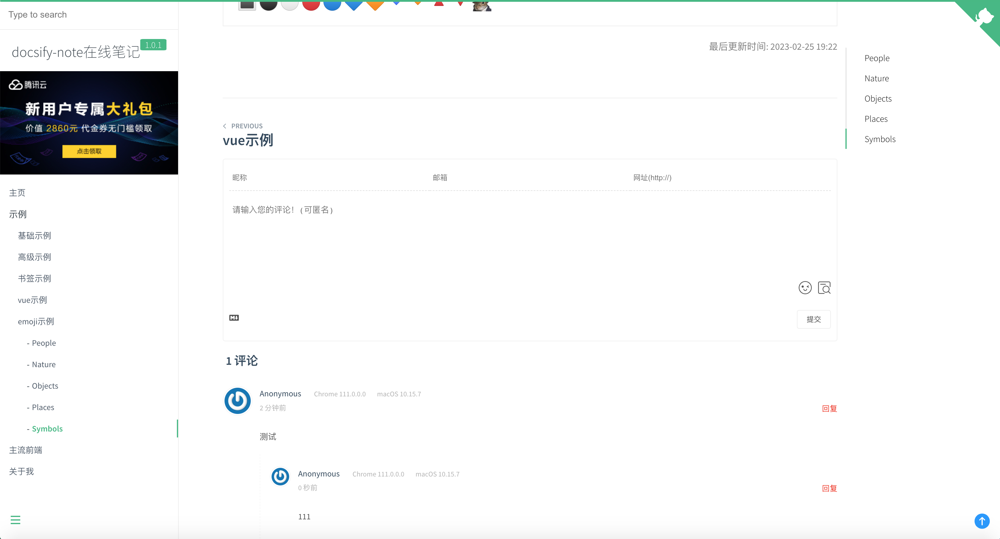

# docsify-mango-valine
docsify valine plugin，集成valine评论插件！

[](https://www.npmjs.com/package/docsify-mango-valine)




## Usage
1. [Applay valine](https://valine.js.org/quickstart.html) ，申请 valine

2. Configure docsify-mango-valine:

    ```html
    <script>
    window.$docsify = {
      valine:{
        appId: "",
        appKey: "",
        // other key in https://valine.js.org/configuration.html
      },
    }
    </script>
    ```

3. Insert script into docsify document:

    ```html
    <!-- 评论  -->
    <script src='//cdn.jsdelivr.net/npm/valine/dist/Valine.min.js'></script>
    <script src="https://unpkg.com/docsify-mango-valine@1.1.1/dist/docsify-mango-valine.min.js"></script>
    ```
